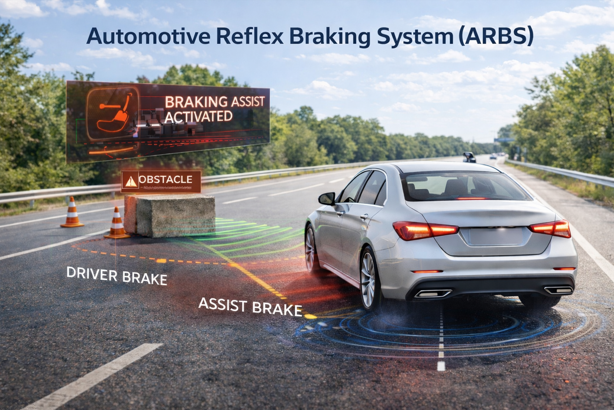
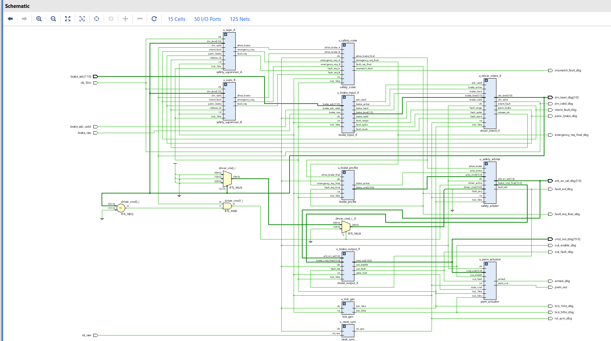
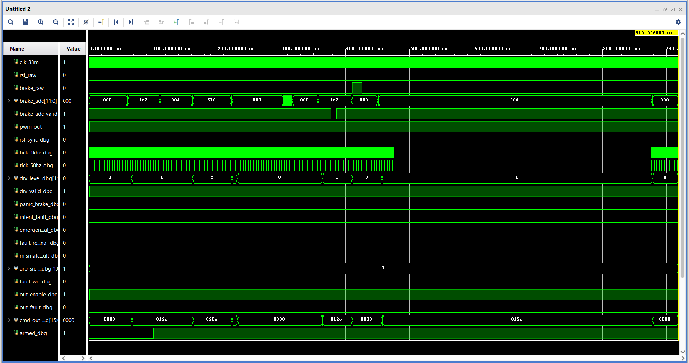
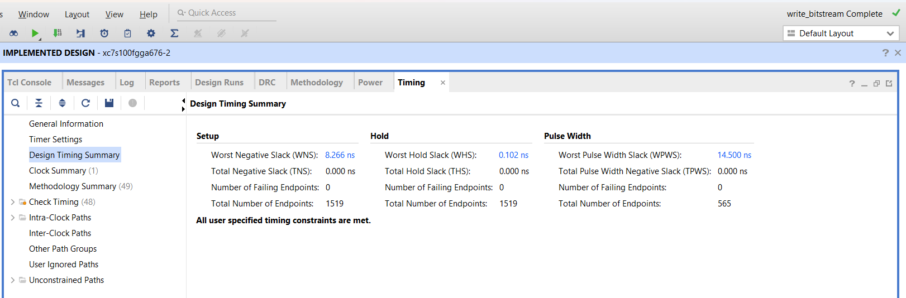

<div align="center">

# 🚗 FPGA Automotive Reflex Braking System (ARBS)

<i>SystemVerilog Safety Architecture · Driver Intent · Dual Supervisors · Watchdog · ToF-Ready Reflex Path · PWM Actuation</i>

<br><br>



</div>

<br>

## ✨ <i>Overview</i>

**ARBS** is a SystemVerilog-based FPGA safety architecture for reflex-style braking assistance.

The project demonstrates how braking intent, safety supervision, fault handling, arbitration, emergency command shaping, and actuator output generation can be implemented as a deterministic RTL pipeline on FPGA.

Unlike a software-loop based controller, ARBS keeps the control path hardware-driven, making timing behavior predictable, inspectable, and suitable for real-time safety-oriented experimentation.

> ARBS is designed as a driver-first safety architecture, not as an autonomous braking replacement.

---

## 🧩 <i>System Architecture</i>

<p align="center">
  
</p>

<p align="center">
  Driver input, safety supervision, arbitration, and PWM actuator output integrated as one RTL pipeline.
</p>

---

## ⚙️ <i>Control Pipeline</i>

```text
Brake Input
   ↓
Input Conditioning
   ↓
Driver Intent Detection
   ↓
Dual Safety Supervisors
   ↓
Safety Voter
   ↓
Brake Profile Generator
   ↓
Safety Arbiter
   ↓
Output Interface
   ↓
PWM Actuator
```

---

## 🚘 <i>Real-Time Braking Behavior</i>

ARBS is built around a simple safety idea:

> The driver remains in control, but the FPGA can assist when braking behavior becomes urgent, unstable, or time-critical.

In normal driving, the system allows the driver brake command to pass through transparently. When the input pattern indicates panic braking or a high-risk condition, ARBS supervises the event through deterministic RTL logic and generates a bounded emergency-assist command.

<div align="center">

| Situation | ARBS Response |
|----------|---------------|
| Normal brake press | Driver command passes through the arbiter |
| Light / medium braking | Driver intent is validated and forwarded smoothly |
| Hard / panic braking | Supervisors confirm urgency and enable emergency brake profiling |
| Noisy brake signal | Debounce, hysteresis, and validity hold prevent false behavior |
| ADC spike / stuck / range fault | Fault logic prevents unsafe command trust |
| Supervisor mismatch | Voter raises mismatch fault for safety visibility |
| Watchdog expiry | Output path disables actuation through fail-silent behavior |
| Brake release | Command ramps down safely to zero |

</div>

This makes ARBS useful as a reflex-assist safety architecture. It does not replace the driver; it supervises driver intent and provides a bounded hardware-assist path when the situation requires faster and more predictable control.

---

## 📡 <i>ToF-Ready Reflex Braking Path</i>

ARBS is structured to support a Time-of-Flight based reflex input path for sudden obstacle detection.

In real driving, accident risk can increase when driver reaction is delayed by even a small amount. A ToF distance sensor can provide front-object distance information to the FPGA, allowing a hardware reflex path to evaluate very-close obstacle conditions without waiting for a software loop.

The intended ToF reflex path is:

<div align="center">

| Stage | Function |
|------|----------|
| ToF Sensor | Measures front-object distance |
| Sensor Interface | Provides valid distance data to FPGA logic |
| Reflex Detector | Detects very-close or fast-closing obstacle condition |
| Safety Supervisors | Validate emergency condition |
| Safety Arbiter | Selects emergency assist when required |
| Brake Profile | Generates bounded braking command |
| PWM Actuator | Outputs controlled braking signal |

</div>

The FPGA does not make the sensor itself faster, but once valid distance data is available, the RTL decision path can respond deterministically through clocked hardware logic and control ticks.

In this project, the control pipeline is organized around a 1 kHz timing base, giving millisecond-level supervisory behavior while keeping the system predictable and easy to verify.

> In the current repository, the ToF path is presented as a safety-architecture extension unless the ToF sensor interface is connected in the published top-level RTL.

---

## 🛡️ <i>Safety Architecture</i>

ARBS follows a driver-first safety architecture. The system does not replace the driver; it supervises braking intent and provides a bounded emergency-assist path when required.

<div align="center">

| Module | Role |
|------|------|
| [`reset_sync.sv`](./rtl/reset_sync.sv) | Generates clean synchronized reset |
| [`tick_gen.sv`](./rtl/tick_gen.sv) | Generates 1 kHz control tick and 50 Hz actuator tick |
| [`brake_input_if.sv`](./rtl/brake_input_if.sv) | Conditions digital and ADC brake inputs |
| [`driver_intent_if.sv`](./rtl/driver_intent_if.sv) | Converts brake input into stable driver intent |
| [`safety_supervisor_A.sv`](./rtl/safety_supervisor_A.sv) | Direct threshold-and-timer safety channel |
| [`safety_supervisor_B.sv`](./rtl/safety_supervisor_B.sv) | Risk-score based safety channel |
| [`safety_voter.sv`](./rtl/safety_voter.sv) | Votes supervisor outputs and detects mismatch |
| [`brake_profile.sv`](./rtl/brake_profile.sv) | Generates controlled emergency brake command |
| [`safety_arbiter.sv`](./rtl/safety_arbiter.sv) | Selects driver or emergency braking authority |
| [`brake_output_if.sv`](./rtl/brake_output_if.sv) | Applies slew limiting, watchdog cut, and CRC marker |
| [`pwm_actuator.sv`](./rtl/pwm_actuator.sv) | Generates servo-style PWM actuator output |
| [`top_arbs.sv`](./rtl/top_arbs.sv) | Integrates the complete ARBS RTL pipeline |

</div>

---

## 🚦 <i>Key Features</i>

- Fully written in **SystemVerilog RTL**
- Deterministic FPGA-based control path
- Driver-first braking behavior
- Digital brake switch and ADC brake magnitude support
- Brake input debounce and hysteresis
- ADC range, spike, and stuck-signal fault detection
- Panic braking detection
- Dual supervisor safety decision channels
- Voter-based mismatch detection
- Watchdog-based stale timing detection
- Fault-aware fail-silent output behavior
- Bounded command generation using `CMD_MAX`
- Slew-limited actuator command output
- Alive counter and CRC-8 integrity marker
- Servo-style PWM braking actuator demonstration
- ToF-ready reflex braking architecture for future sensor integration

---

## 🛠️ <i>Target Platform</i>

<div align="center">

| Item | Details |
|------|---------|
| FPGA Board | Xilinx SP701 Evaluation Board |
| FPGA Family | Spartan-7 |
| Clock Used | 33.333 MHz system clock with 1 kHz control tick and 50 Hz PWM actuator frame |
| HDL | SystemVerilog |
| Toolchain | Xilinx Vivado |
| Verification | Full-system RTL simulation testbench |

</div>

---

## 🧪 <i>Verification</i>

A full-system testbench validates the ARBS pipeline across braking, release, noise, fallback, and fault-observation scenarios.

<div align="center">

| Scenario | Purpose |
|---------|---------|
| S0 Idle | Confirms no unintended braking |
| S1 Light Brake | Checks normal driver command path |
| S2 Medium Brake | Validates stable intent detection |
| S3 Higher Brake Level | Checks supervisor and voter stability |
| S4 Release | Confirms command returns safely to zero |
| S5 Input Noise | Verifies noise rejection behavior |
| S6 Brief ADC Invalid | Checks validity-hold behavior |
| S7 Digital Brake Press | Verifies digital fallback path |
| S8 Supervisor Agreement | Confirms no false mismatch fault |
| S9 Watchdog Observation | Observes timing fault behavior |
| S10 Final Release | Confirms safe return to idle |

</div>

The testbench uses accelerated timing pulses for faster simulation while preserving system-level control behavior.

---

## 📊 <i>Results</i>

<p align="center">
  
</p>

<p align="center">
  Full-system RTL waveform showing braking input, driver intent, arbitration, output command, and PWM behavior.
</p>

<br>

<p align="center">
  
</p>

<p align="center">
  Vivado timing summary after FPGA implementation.
</p>

---

## 📁 <i>Repository Structure</i>

```text
rtl/          → SystemVerilog RTL modules
tb/           → System-level testbench
results/      → diagrams, waveforms, timing screenshots
```

---

## 🔗 <i>Detailed Documentation</i>

<div align="center">

| Area | Description |
|------|------------|
| ⚙️ <a href="./rtl/README.md"><b>RTL Design</b></a> | module-level architecture and signal flow |
| 🧪 <a href="./tb/README.md"><b>Verification</b></a> | testbench scenarios and validation checks |
| 📊 <a href="./results/README.md"><b>Results</b></a> | waveforms, timing screenshots, and simulation outputs |

</div>

---

## 🎯 <i>Project Scope</i>

ARBS is developed as an FPGA-based safety-control architecture to demonstrate deterministic braking assistance, RTL supervision, fault handling, arbitration, and actuator command generation.

The design is intended for simulation, FPGA implementation, and professional FPGA design demonstration.

---

## 📜 License

This project is licensed under the MIT License.

---

<div align="center">

<b>Built in SystemVerilog for deterministic FPGA-based safety-control design.</b>

</div>
